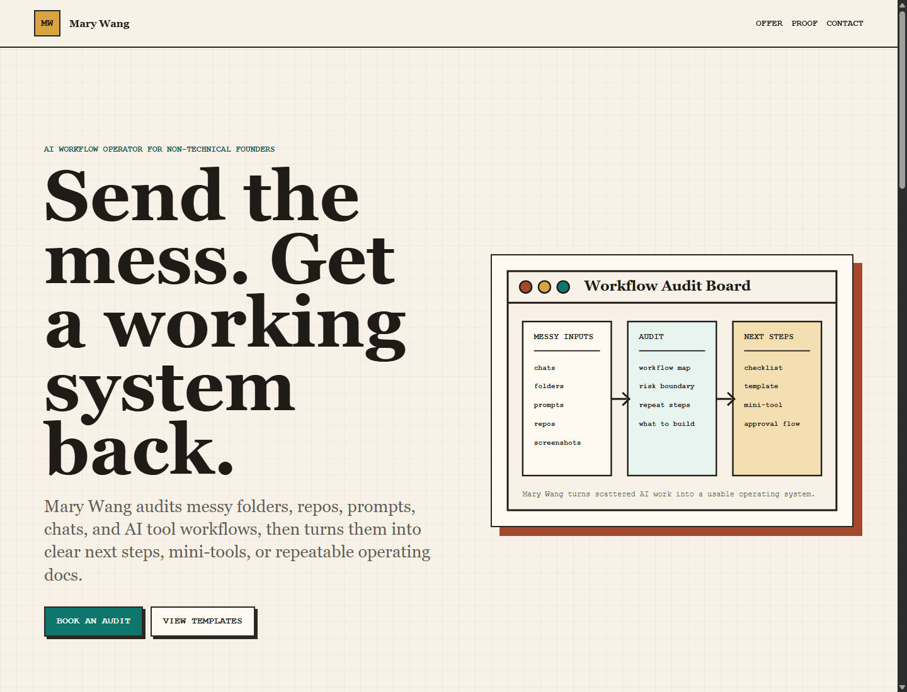

# Mary Wang AI Workflow Operator

Mary Wang is a bilingual AI-assisted operator for non-technical founders and small teams.

Core promise:

> Send a messy workflow, folder, repo, AI tool idea, or automation problem. Mary turns it into a clear audit, a usable mini-tool, or a working AI-assisted process.

This repository is the public proof base for the Mary Wang revenue sprint. It contains the brand, paid offers, proof assets, content drafts, lead tracking, a simple service page, and a safe AI workflow audit skill template.

Live links:

- GitHub: [marywang-aiops/mary-wang-ai-workflow-operator](https://github.com/marywang-aiops/mary-wang-ai-workflow-operator)
- Service page: [Mary Wang AI Workflow Audit](https://marywang-aiops.github.io/mary-wang-ai-workflow-operator/)
- Public contribution log: [proof/public-contribution-log.md](proof/public-contribution-log.md)

## First Paid Offer

**Audit Artifact Review**

Price: USD 99 / RMB 699

Delivery: 48 hours after receiving the materials

Contact: [939172168@qq.com](mailto:939172168@qq.com)

Best for audit manifests, review-gate docs, workflow handoff artifacts, and machine-readable audit output.

Payment is available by WeChat Pay or Alipay after scope confirmation. QR codes are sent by email and are not published in this repository.

## What Is Inside

- `brand/`: identity, positioning, operating rules
- `offers/`: paid service pages and pricing
- `proof/`: public templates and audit checklists
- `content/`: Reddit, GitHub, Zhihu, and Xiaohongshu drafts
- `leads/`: lead tracker and outreach log
- `operations/`: 14-day revenue sprint and weekly review system
- `operations/active-outreach-pipeline.md`: daily proactive community outreach system
- `operations/revenue-loop-operating-system.md`: full funnel, review cadence, and pivot rules
- `projects/openclaw-skills/`: safe AI workflow audit skill template
- `site/`: static service page that can be opened directly in a browser
- `accounts/`: platform setup guides and profile copy
- `release/`: publishing checklist

## Launch Order

1. Open `site/index.html` and review the offer page.
2. Publish this repository to GitHub.
3. Share `proof/ai-workflow-audit-checklist.md` as the first useful public asset.
4. Share `proof/sample-ai-workflow-audit.md` when a buyer asks what they will receive.
5. Share `proof/before-after-ai-workflow-audit-example.md` when someone needs a before/after example.
6. Share `proof/public-contribution-log.md` when someone asks for public proof.
7. Start tracking outreach in `leads/lead-tracker.csv`.
8. Use `operations/revenue-loop-operating-system.md` as the revenue loop source of truth.
9. Use `content/email-templates.md` to convert interest into a paid audit.
10. Use `operations/14-day-revenue-sprint.md` as the daily work plan.
11. Follow `accounts/github-setup.md` before publishing. Do not use the `Erica1018` GitHub account.

## Rules

- No fake credentials, fake clients, fake testimonials, fake revenue, or spam.
- Do not mass-post promotional content.
- Lead with useful public work, then offer paid help only when relevant.
- For non-technical buyers, explain every required step plainly.
- Treat the first revenue target as one paid audit, not broad popularity.
- Keep `private/` out of GitHub. It contains local-only payment QR codes.
